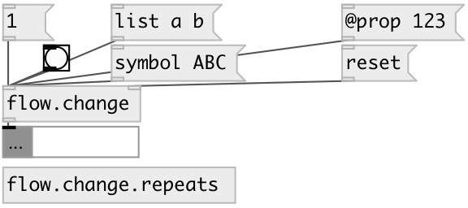

[index](index.html) :: [flow](category_flow.html)
---

# flow.change

###### rejects redundant input values

*available since version:* 0.3

---

## information
The object passes input values only when it&#39;s changed. You can &#34;set&#34; the current value, or bang to force output. Note: [list a b c( and [a b c( are different values!

## properties:

* **@onrepeat** 
Get/set function called when repeat occurs 
_type:_ symbol 

## inlets:

* force output current value 
_type:_ control
* reset: reset state 
_type:_ control

## outlets:

* output only if input changed 
_type:_ control

## keywords:

[flow](keywords/flow.html)
[change](keywords/change.html)

**See also:**
[\[change\]](change.html)

**Authors:** Serge Poltavsky

**License:** GPL3 or later

