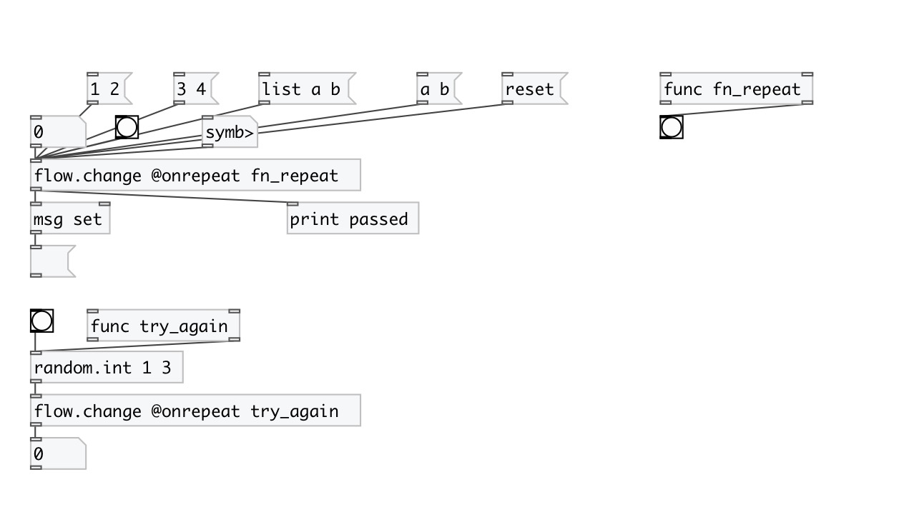
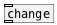

[< reference home](index.html)
---

# flow.change

rejects redundant input values

---

The object passes input values only when it&#39;s changed. You can &#34;set&#34; the current
            value, or bang to force output.
Note: [list a b c( and [a b c( are different values!
 

---

---
arguments:

---
properties:

@onrepeat: function called when repeat occurs 

---
see also: 

