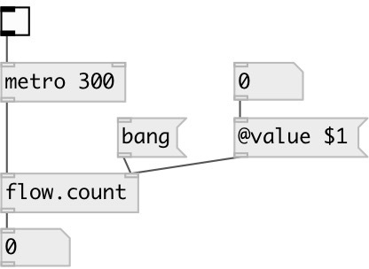

[index](index.html) :: [flow](category_flow.html)
---

# flow.count

###### control flow event counter

*available since version:* 0.4

---

## arguments:

* **N**
counter init value 
_type:_ int 

## properties:

* **@value** 
Get/set current counter state. Can be set via message to second(!) inlet or [prop.set]
object. 
_type:_ int 
_min value:_ 0 
_default:_ 0 

## inlets:

* input messages 
_type:_ control
* reset counter to init value 
_type:_ control

## outlets:

* outputs event number 
_type:_ control

## keywords:

[counter](keywords/counter.html)

**Authors:** Serge Poltavsky

**License:** GPL3 or later

