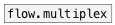

[< reference home](ceammc_lib.html)
---

# flow.demultiplex


control flow demultiplexer

```


[F]
|
|                 [ui.radio @nitems 4]
|                 |
|                 |.
[flow.demultiplex 4]
|   ^|   ^^|   ^^^|
[F]  [F]   [F]   [F]

            
```

---
arguments:

N: number of outlets<br>

---
properties:

@index: current demultiplexer
            output index<br>
@noprops: pass all properties requests. When this flag is
            specified you can&#39;t get or set @index property of current object: use right
            inlet<br>

---
see also:<br>
[](flow.multiplex.html)
