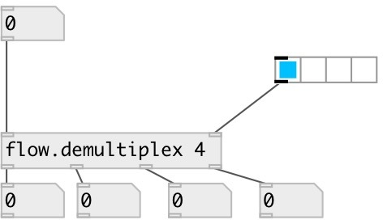

[index](index.html) :: [flow](category_flow.html)
---

# flow.demultiplex
**aliases:** [flow.demux]

###### control flow demultiplexer

*available since version:* 0.6

---

## information
Note: you can get/set object properties only via prop.set/prop.get objects

## arguments:

* **N**
number of outlets 
_type:_ int 

## properties:

* **@index** 
Get/set current demultiplexer output index 
_type:_ int 
_min value:_ 0 
_default:_ 0 

## inlets:

* input flow inlet 
_type:_ control
* output selector 
_type:_ control

## outlets:

* demultiplexer first output 
_type:_ control
* demultiplexer N-th output 
_type:_ control

## keywords:

[demultiplex](keywords/demultiplex.html)

**See also:**
[\[flow.multiplex\]](flow.multiplex.html)

**Authors:** Serge Poltavsky

**License:** GPL3 or later

