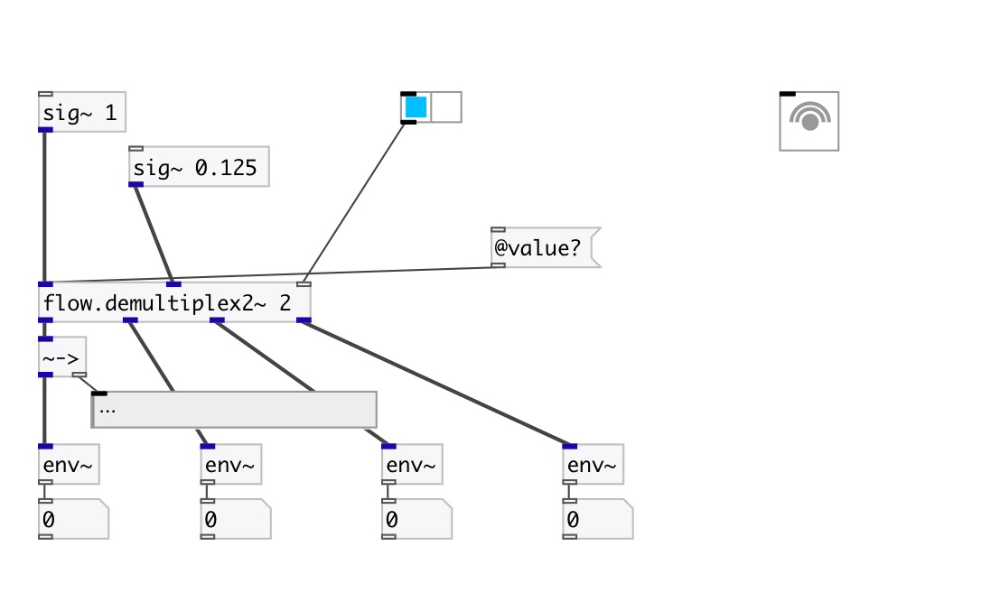

[< reference home](index.html)
---

# flow.demultiplex2~

audio stream stereo demultiplexer

---

 

---

---
arguments:

N: number of output
            stereo-pairs 

---
properties:

@value: gain coefficients per each
            output 

---
see also: 

