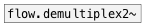
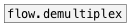

[<<< reference home](ceammc_lib.md)
---

# flow.demultiplex~

```


[osc~ 440]    [ui.radio @nitems 4] [ui.dsp~]
|             |
| [@value?(   |
| |           |.
[flow.demultiplex~ 4 #a]
|
[~->]
| ^|
|  [ui.display @display_type=1]
|
[env~]   [env~ #b] [env~ #c] [env~ #d]
|        |         |         |
[F]      [F]       [F]       [F]

[X a:1->b]
[X a:2->c]
[X a:3->d]

            
```
---
audio stream demultiplexer
---
arguments:

N: number of signals
            outputs<br>

---
properties:

@value: gain coefficients per each
            output<br>

---
see also:<br>
[](flow.demultiplex2~.md)
[](flow.demultiplex.md)
