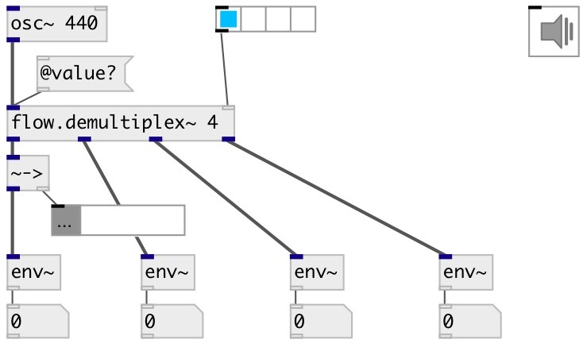

[index](index.html) :: [flow](category_flow.html)
---

# flow.demultiplex~

###### audio stream demultiplexer

*available since version:* 0.6

---

## arguments:

* **N**
number of signals outputs 
__type:__ int 

## properties:

* **@value** 
Get/set gain coefficients per each output 
__type:__ list 
__default:__ 1 0 

## inlets:

* input signal 
__type:__ audio 
* demultiplexer control 
__type:__ control 

## outlets:

* first output
__type:__ audio 
* ... output
__type:__ audio 
* n-th output
__type:__ audio 

## keywords:

[flow](keywords/flow.html)
[demultiplex](keywords/demultiplex.html)

**See also:**
[\[flow.demultiplex2~\]](flow.demultiplex2~.html)
[\[flow.demultiplex\]](flow.demultiplex.html)

**Authors:** Serge Poltavsky

**License:** GPL3 or later

