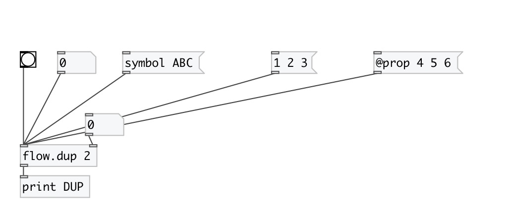

[index](index.html) :: [flow](category_flow.html)
---

# flow.dup

###### message duplicator

*available since version:* 0.9.1

---

## information
Output incoming message specified number of times

## arguments:

* **N**
number of repeats 
__type:__ int 

## properties:

* **@n** 
Get/set number of repeats 
__type:__ int 
__min value:__ 0 
__default:__ 2 

## inlets:

* incoming message 
__type:__ control 
* set number of repeats 
__type:__ control 

## outlets:

* output
__type:__ control 

## keywords:

[flow](keywords/flow.html)
[duplicate](keywords/duplicate.html)
[repeat](keywords/repeat.html)

**See also:**
[\[flow.mem\]](flow.mem.html)

**Authors:** Serge Poltavsky

**License:** GPL3 or later

