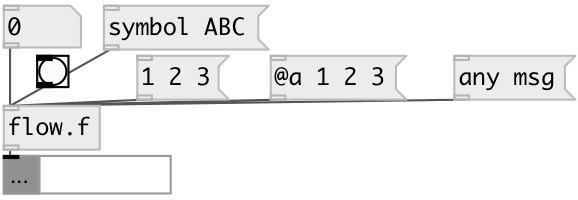

[index](index.html) :: [flow](category_flow.html)
---

# flow.float

###### pass floats

*available since version:* 0.9.4

---

## inlets:

* passed float 
__type:__ control 

## outlets:

* passed float
__type:__ control 

## keywords:

[pass](keywords/pass.html)

**Authors:** Serge Poltavsky

**License:** GPL3 or later

