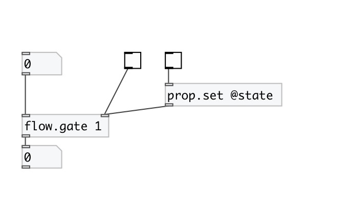

[< reference home](index.html)
---

# flow.gate

control flow gate. [spigot] analog

---

 

---

---
arguments:

PASS: init gate state. 1 means open, 0 - closed. By default
            gate is closed 

---
properties:

@state: gate state. 1 means open, 0 -
            closed 

---
see also: 

