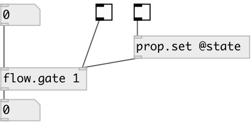

[index](index.html) :: [flow](category_flow.html)
---

# flow.gate
**aliases:** [ceammc/gate], [gate]

###### control flow gate. [spigot] analog

*available since version:* 0.4

---

## information
Note: property setting can be done only via [prop.set] object, since object accepts all incoming messages

## arguments:

* **STATE**
init gate state. 1 means open, 0 - closed. By default gate is closed 
_type:_ bool 

## properties:

* **@state** 
Get/set gate state. 1 means open, 0 - closed 
_type:_ bool 
_default:_ 0 

## inlets:

* input flow 
_type:_ control
* gate control inlet. Sending *1* opens gate, *0* - closes 
_type:_ control

## outlets:

* output flow 
_type:_ control

## keywords:

[gate](keywords/gate.html)

**See also:**
[\[flow.pass\]](flow.pass.html)

**Authors:** Serge Poltavsky

**License:** GPL3 or later

