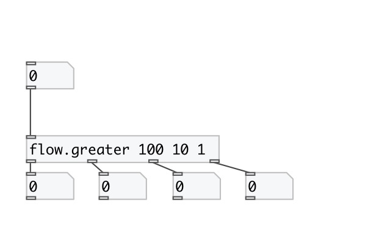
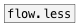

[< reference home](index.html)
---

# flow.greater

numeric stream router

---

Numbers thar are *less* or *equal* then first argument are passed to N-th
            inlet
 

---

---
arguments:

LIST: compare values: list of floats in descending
            order 

---
properties:

---
see also: 

