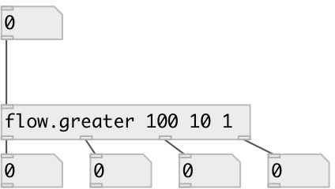

[index](index.html) :: [flow](category_flow.html)
---

# flow.greater
**aliases:** [flow.&gt;]

###### numeric stream router

*available since version:* 0.9.1

---

## information
Numbers thar are *less* or *equal* then last argument are passed to N-th inlet

## arguments:

* **LIST**
compare values: list of floats in descending order 
_type:_ list 

## properties:

* **@values** 
Get/set compare values: list of floats in descending order 
_type:_ list 

## inlets:

* input flow 
_type:_ control

## outlets:

* numbers that are greater then 1st argument 
_type:_ control
* numbers that are greater than ... argument 
_type:_ control
* numbers that are greater than last argument 
_type:_ control
* numbers that are less or equal than last argument 
_type:_ control

## keywords:

[gate](keywords/gate.html)
[greater](keywords/greater.html)

**See also:**
[\[flow.less\]](flow.less.html)

**Authors:** Serge Poltavsky

**License:** GPL3 or later

