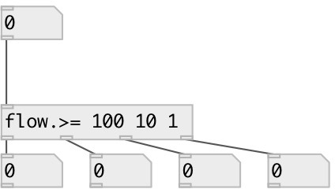

[index](index.html) :: [flow](category_flow.html)
---

# flow.greater_eq

###### numeric stream router

*available since version:* 0.9

---

## information
Numbers thar are *less* then last argument are passed to N+1 inlet

## arguments:

* **LIST**
compare values: list of floats in descending order 
__type:__ list 

## properties:

* **@values** 
Get/set compare values: list of floats in descending order 
__type:__ list 

## inlets:

* input flow 
__type:__ control 

## outlets:

* numbers that are greater or equal then 1st argument
__type:__ control 
* numbers that are greater or equal than ... argument
__type:__ control 
* numbers that are greater or equal than last argument
__type:__ control 
* numbers that are less than last argument
__type:__ control 

## keywords:

[gate](keywords/gate.html)
[greater](keywords/greater.html)
[equal](keywords/equal.html)

**See also:**
[\[flow.less\]](flow.less.html)

**Authors:** Serge Poltavsky

**License:** GPL3 or later

