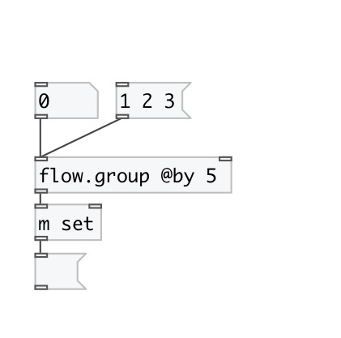

[< reference home](index.html)
---

# flow.group

group data atoms in list of specified size

---

 

---

---
arguments:

SIZE: group by this size 

---
properties:

@by: group size 
@free: free space left in group 

