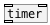

[<<< reference home](ceammc_lib.md)
---

# flow.interval

```


[T]      [F]
|        |.
[metro 100]
|
|  [F]
|  |
[flow.interval]
|
[F]

            
```
---
measure time between flow events
---
arguments:


---
properties:


---
see also:<br>
[](timer.md)
