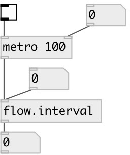

[index](index.html) :: [flow](category_flow.html)
---

# flow.interval

###### measure the time between messages

*available since version:* 0.6

---

## inlets:

* input flow 
_type:_ control

## outlets:

* output time between the current and the previous message in milliseconds 
_type:_ control

## keywords:

[time](keywords/time.html)
[interval](keywords/interval.html)

**See also:**
[\[timer\]](timer.html)

**Authors:** Serge Poltavsky

**License:** GPL3 or later

