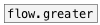
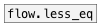

# flow.less

```


[F]
|
|
|
[flow.less 0 10 20 30      ]
|     ^|   ^^|   ^^^|  ^^^^|
[F]   [F]   [F]   [F]    [F]

            
```
---
arguments:

LIST: compare values: list of floats in ascending
            order<br>

---
properties:


see also:<br>


