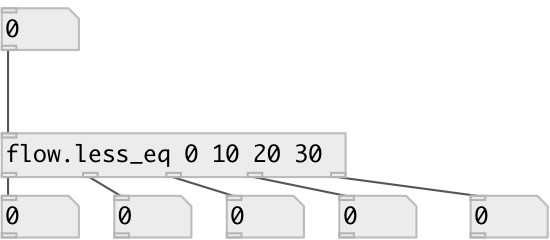

[index](index.html) :: [flow](category_flow.html)
---

# flow.less_eq
**aliases:** [flow.&lt;=]

###### numeric stream router, like many [moses]

*available since version:* 0.4

---

## information
Numbers thar are *less equal* then N-th argument are passed to N-th inlet

## arguments:

* **VALUES**
compare values: list of floats in ascending order 
_type:_ list 

## properties:

* **@values** (initonly)
Get/set compare values: list of floats in ascending order 
_type:_ list 

## inlets:

* input flow 
_type:_ control

## outlets:

* numbers that are less equal then 1st argument 
_type:_ control
* numbers that are less equal than ... argument 
_type:_ control
* numbers that are less equal than N-th argument 
_type:_ control
* numbers that are greater than last argument 
_type:_ control

## keywords:

[gate](keywords/gate.html)

**See also:**
[\[flow.less\]](flow.less.html)

**Authors:** Serge Poltavsky

**License:** GPL3 or later

