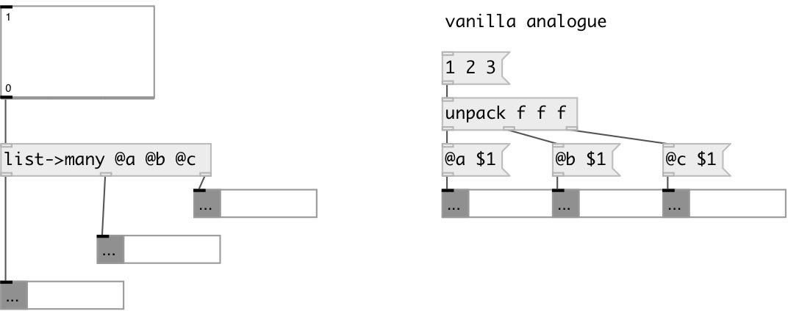

[index](index.html) :: [flow](category_flow.html)
---

# flow.list2many
**aliases:** [ceammc/list-&gt;many], [list-&gt;many]

###### routes list element with message selectors

*available since version:* 0.9.2

---

## information
On incoming list (l⁰ l¹ ...) outputs to corresponding outlet message: [s⁰ l⁰(, [s¹ l¹( etc...

## arguments:

* **SEL**
list of selectors 
_type:_ list 

## inlets:

* input list 
_type:_ control

## outlets:

* first element with first selector 
_type:_ control
* ... element with ... selector 
_type:_ control
* nth element with nth selector 
_type:_ control

## keywords:

[conv](keywords/conv.html)
[map](keywords/map.html)
[list](keywords/list.html)

**Authors:** Serge Poltavsky

**License:** GPL3 or later

