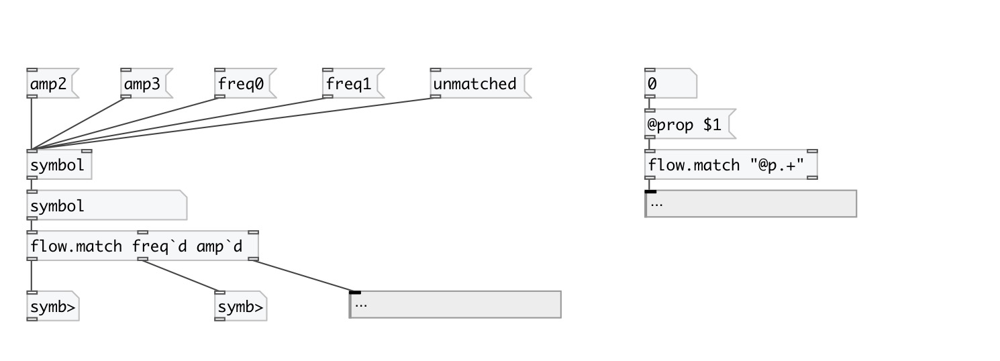
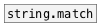

[< reference home](index.html)
---

# flow.match

route data flow by regexp match

---

 

---

---
arguments:

RE_LST: list of regular
            expressions 

---
properties:

@cut: cut or pass message
            selector 

---
see also: 

