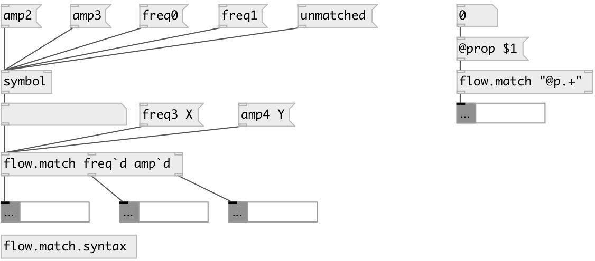

[index](index.html) :: [flow](category_flow.html)
---

# flow.match

###### route data flow by regexp match

*available since version:* 0.7.1

---

## information
Use backtick ` instead of backslash in regexp syntax if you want to match property - use double quotes in arg list: &#34;@prop+&#34;

## arguments:

* **RE_LST**
list of regular expressions 
_type:_ list 

## properties:

* **@patterns** 
Get/set list of regular expressions 
_type:_ list 

* **@cut** 
Get/set cut or pass message selector 
_type:_ int 
_enum:_ 0, 1 
_default:_ 0 

## inlets:

* input message 
_type:_ control
* set first regexp 
_type:_ control
* set ... regexp 
_type:_ control
* set n-th regexp 
_type:_ control

## outlets:

* output match to first regexp 
_type:_ control
* output match to ... regexp 
_type:_ control
* output match to n-th regexp 
_type:_ control
* unmatched output 
_type:_ control

## keywords:

[regexp](keywords/regexp.html)

**See also:**
[\[string.match\]](string.match.html)

**Authors:** Serge Poltavsky

**License:** GPL3 or later

