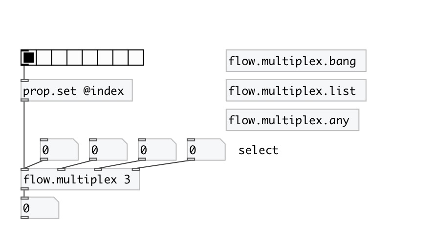

[< reference home](index.html)
---

# flow.multiplex

control flow multiplexer

---

 

---

---
arguments:

N: number of inlets 

---
properties:

@index: current multiplexer
            index 

---
see also: 

