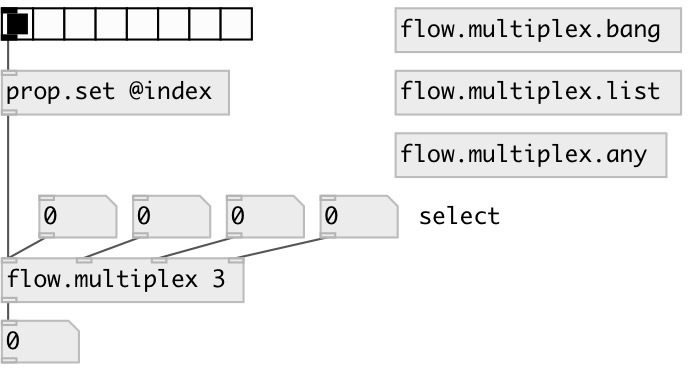

[index](index.html) :: [flow](category_flow.html)
---

# flow.multiplex
**aliases:** [flow.mux]

###### control flow multiplexer

*available since version:* 0.6

---

## information
Warning: in v0.9 extra inlet added to select input Set @index property only via [prop.set]

## arguments:

* **N**
number of multiplexed inputs 
_type:_ int 

* **N**
default input index 
_type:_ int 

## properties:

* **@index** 
Get/set input index 
_type:_ int 
_range:_ 0..23 
_default:_ 0 

## inlets:

* multiplexer first inlet 
_type:_ control
* multiplexer N-th inlet 
_type:_ control
* set input index 
_type:_ control

## outlets:

* output 
_type:_ control

## keywords:

[multiplex](keywords/multiplex.html)

**See also:**
[\[flow.demultiplex\]](flow.demultiplex.html)

**Authors:** Serge Poltavsky

**License:** GPL3 or later

