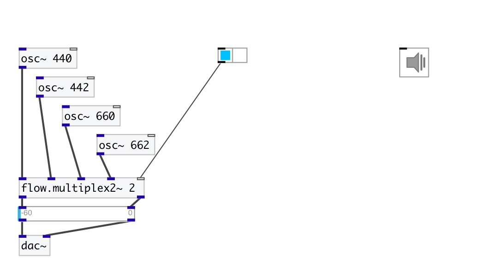

[index](index.html) :: [flow](category_flow.html)
---

# flow.multiplex2~
**aliases:** [flow.mux2\~], [ceammc/mux2\~], [mux2\~]

###### audio stream stereo multiplexer

*available since version:* 0.6

---

## arguments:

* **N**
number of input stereo-pairs 
_type:_ int 

## properties:

* **@value** 
Get/set gain coefficients per each input 
_type:_ list 
_default:_ 1 0 

## inlets:

* first left input signal 
_type:_ audio
* first right input signal 
_type:_ audio
* ... left input signal 
_type:_ audio
* ... right input signal 
_type:_ audio
* last left input signal 
_type:_ audio
* last right input signal 
_type:_ audio
* multiplexer control 
_type:_ control

## outlets:

* left output 
_type:_ audio
* right output 
_type:_ audio

## keywords:

[flow](keywords/flow.html)
[multiplex](keywords/multiplex.html)

**See also:**
[\[flow.multiplex~\]](flow.multiplex~.html)
[\[flow.multiplex\]](flow.multiplex.html)

**Authors:** Serge Poltavsky

**License:** GPL3 or later

