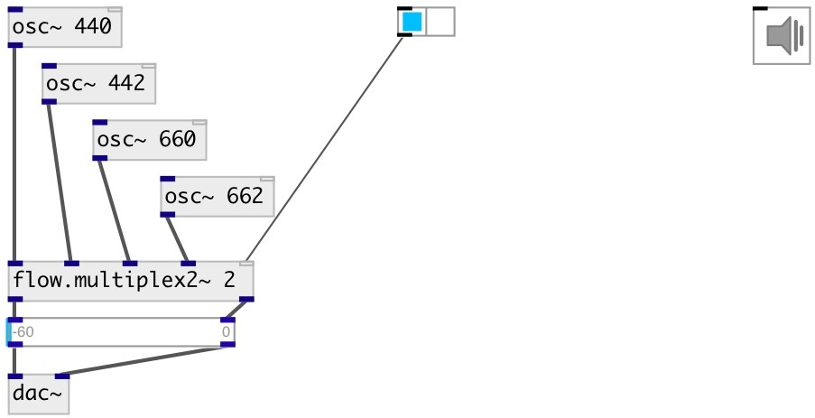

[index](index.html) :: [flow](category_flow.html)
---

# flow.multiplex2~

###### audio stream stereo multiplexer

*available since version:* 0.6

---

## arguments:

* **N**
number of input stereo-pairs 
__type:__ int 

## properties:

* **@value** 
Get/set gain coefficients per each input 
__type:__ list 
__default:__ 1 0 

## inlets:

* first left input signal 
__type:__ audio 
* first right input signal 
__type:__ audio 
* ... left input signal 
__type:__ audio 
* ... right input signal 
__type:__ audio 
* last left input signal 
__type:__ audio 
* last right input signal 
__type:__ audio 
* multiplexer control 
__type:__ control 

## outlets:

* left output
__type:__ audio 
* right output
__type:__ audio 

## keywords:

[flow](keywords/flow.html)
[multiplex](keywords/multiplex.html)

**See also:**
[\[flow.multiplex~\]](flow.multiplex~.html)
[\[flow.multiplex\]](flow.multiplex.html)

**Authors:** Serge Poltavsky

**License:** GPL3 or later

