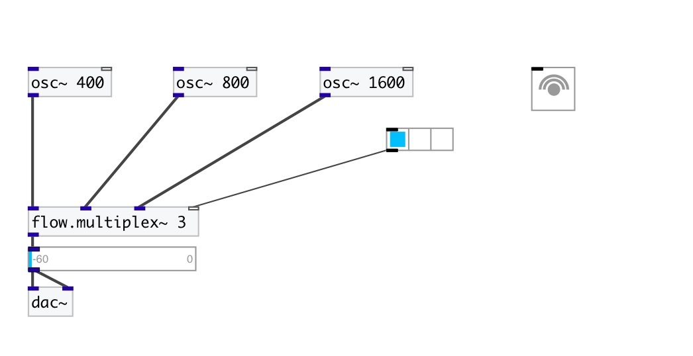

[< reference home](index.html)
---

# flow.multiplex~

audio stream multiplexer

---

 

---

---
arguments:

N: number of signals
            inputs 

---
properties:

@value: gain coefficients per each
            output 

---
see also: 

