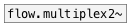

[< reference home](index.html)
---

# flow.multiplex~


audio stream multiplexer

---

<br>


---


```


[osc~ 400] [osc~ 800] [osc~ 1600]     [ui.dsp~]
|          |          |
|          |          |
|          |          |    [ui.radio @nitems 3]
|          |          |    |
|          |          |    |
|          |.         |..  |...
[flow.multiplex~ 3             ]
|
[ui.gain~ @size 120 16]
|\
[dac~]

            
```

---
arguments:

N: number of signals
            inputs<br>

---
properties:

@value: gain coefficients per each
            output<br>

---
see also:<br>
[](flow.multiplex2~.html)
[](flow.multiplex.html)
