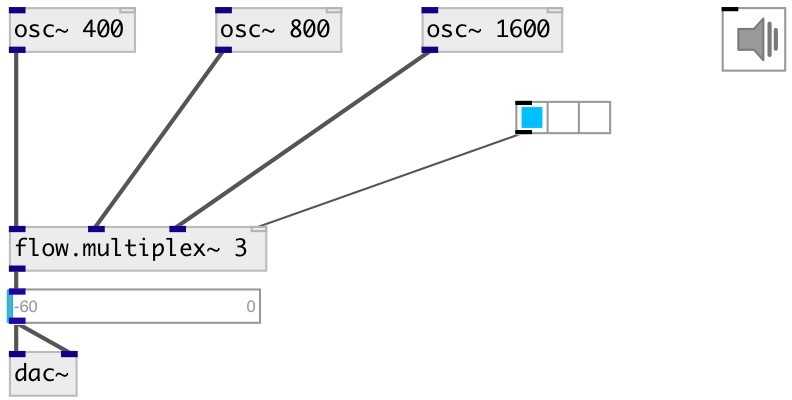

[index](index.html) :: [flow](category_flow.html)
---

# flow.multiplex~

###### audio stream multiplexer

*available since version:* 0.6

---

## arguments:

* **N**
number of signals inputs 
__type:__ int 

## properties:

* **@value** 
Get/set gain coefficients per each output 
__type:__ list 
__default:__ 1 0 

## inlets:

* first input signal 
__type:__ audio 
* last input signal 
__type:__ audio 
* multiplexer control 
__type:__ control 

## outlets:

* output
__type:__ audio 

## keywords:

[flow](keywords/flow.html)
[multiplex](keywords/multiplex.html)

**See also:**
[\[flow.multiplex2~\]](flow.multiplex2~.html)
[\[flow.multiplex\]](flow.multiplex.html)

**Authors:** Serge Poltavsky

**License:** GPL3 or later

