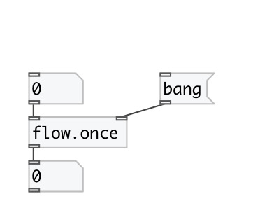

[index](index.html) :: [flow](category_flow.html)
---

# flow.once
**aliases:** [ceammc/once], [once]

###### one message pass thru

*available since version:* 0.6

---

## arguments:

* **OPENED**
set init state 
_type:_ int 

## inlets:

* input flow 
_type:_ control
* reset to opened state 
_type:_ control

## outlets:

* output flow 
_type:_ control

## keywords:

[once](keywords/once.html)
[pass](keywords/pass.html)

**See also:**
[\[flow.gate\]](flow.gate.html)

**Authors:** Serge Poltavsky

**License:** GPL3 or later

