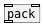
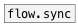

[<<< reference home](ceammc_lib.md)
---

# flow.pack

```


[B]  [F]   [F]  [1 2(   [1 2 3( [F]
|    |     |    |       |       |
|    |     |.   |       |       |..
[flow.pack 3 0 0 ABC {w=20}       ]
|
[ui.display @display_type=1]

            
```
---
flow pack
---
arguments:

N: number of inputs<br>
VALS: default values for all inlets. If not enough default
            values given it sets to 0.<br>

---
properties:


---
see also:<br>
[](pack.md)
[](flow.sync.md)
[](flow.sync_pack.md)
