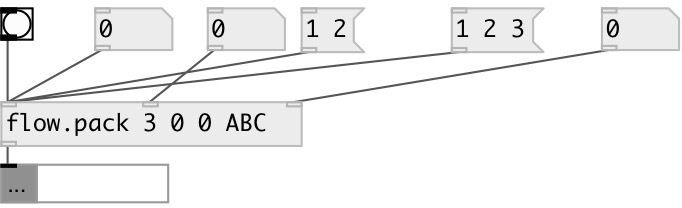

[index](index.html) :: [flow](category_flow.html)
---

# flow.pack

###### flow pack

*available since version:* 0.8

---

## arguments:

* **N**
number of inputs 
_type:_ int 

* **VALS**
default values for all inlets. If not enough default values given it sets to 0. 
_type:_ list 

## properties:

* **@n** 
Get/set number of inlets 
_type:_ int 
_range:_ 1..255 
_default:_ 1 

* **@init** 
Get/set default init values 
_type:_ list 

## inlets:

* output current value 
_type:_ control
* change ... packed value 
_type:_ control
* change n-th packed value 
_type:_ control

## outlets:

* packed list or message (if message input) 
_type:_ control

## keywords:

[flow](keywords/flow.html)
[pack](keywords/pack.html)

**See also:**
[\[pack\]](pack.html)
[\[flow.sync\]](flow.sync.html)
[\[flow.sync_pack\]](flow.sync_pack.html)

**Authors:** Serge Poltavsky

**License:** GPL3 or later

