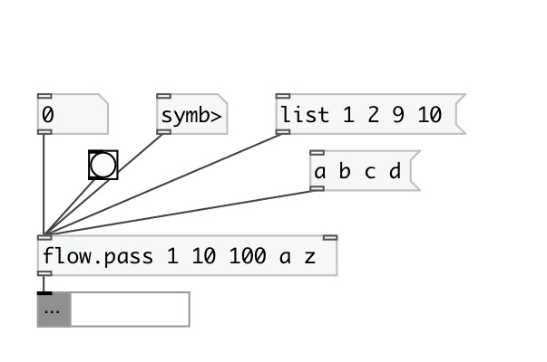

[index](index.html) :: [flow](category_flow.html)
---

# flow.pass

###### pass specified values

*available since version:* 0.3

---

## properties:

* **@values** 
Get/set atoms to pass 
_type:_ list 

## inlets:

* pass 
_type:_ control
* set pass list 
_type:_ control

## outlets:

* passed values 
_type:_ control

## keywords:

[pass](keywords/pass.html)
[functional](keywords/functional.html)

**See also:**
[\[flow.pass_if\]](flow.pass_if.html)
[\[flow.reject\]](flow.reject.html)

**Authors:** Serge Poltavsky

**License:** GPL3 or later

