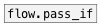
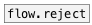

[< reference home](ceammc_lib.html)
---

# flow.pass


pass specified values

```


[F]    [S]    [list 1 2 9 10(
|      |      |
|  [B] |      |
|  |   |      |
|  |   |      |
[flow.pass 1 10 100 a z]
|
[msg set]
|
[ (


            
```

---
arguments:


---
properties:

@values: atoms to pass<br>

---
see also:<br>
[](flow.pass_if.html)
[](flow.reject.html)
