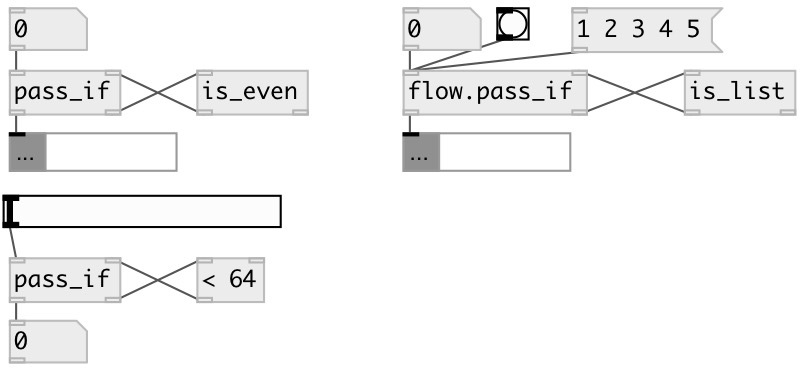

[index](index.html) :: [flow](category_flow.html)
---

# flow.pass_if
**aliases:** [ceammc/pass_if], [pass_if]

###### pass values that accepted by predicate object

*available since version:* 0.3

---

## information
conditional value pass according to *predicate* side-chain. *predicate* should accept value and ouput 0 or 1, for value passing. [&gt;=] [is_even] [is_list] - examples of predicates.

## inlets:

* input value 
_type:_ control
* conditional output from predicate object. &#39;1&#39; means pass, &#39;0&#39; means reject 
_type:_ control

## outlets:

* passed values 
_type:_ control
* output to predicate side-chain 
_type:_ control

## keywords:

[pass](keywords/pass.html)
[functional](keywords/functional.html)

**See also:**
[\[flow.pass\]](flow.pass.html)

**Authors:** Serge Poltavsky

**License:** GPL3 or later

