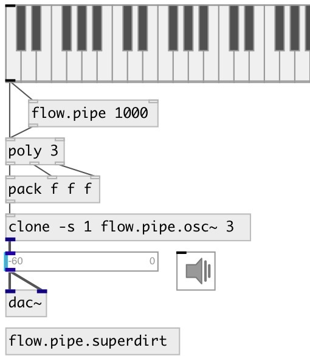

[index](index.html) :: [flow](category_flow.html)
---

# flow.pipe

###### enhanced version on vanilla pipe object

*available since version:* 0.9.1

---

## information
Acts like vanilla [pipe] but for any messages: bangs, floats, symbols etc. Note: @delay property can be set only via right inlet or [prop.set] object

## arguments:

* **MS**
init @delay property 
_type:_ float 
_units:_ ms 

## properties:

* **@delay** 
Get/set delay time 
_type:_ float 
_units:_ ms 
_min value:_ 0 
_default:_ 0 

* **@empty** (readonly)
Get 1 if pipe is empty, otherwise 0. 
_type:_ int 
_enum:_ 0, 1 
_default:_ 1 

* **@size** (readonly)
Get pipe size 
_type:_ int 
_default:_ 0 

## inlets:

* incoming message 
_type:_ control
* clear pipe 
_type:_ control

## outlets:

* pipe output 
_type:_ control

## keywords:

[flow](keywords/flow.html)
[pipe](keywords/pipe.html)

**See also:**
[\[flow.delay\]](flow.delay.html)

**Authors:** Serge Poltavsky

**License:** GPL3 or later

