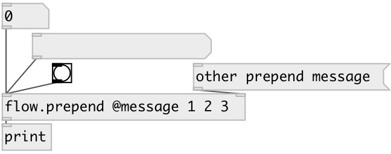

[index](index.html) :: [flow](category_flow.html)
---

# flow.prepend

###### prepend message before received one

*available since version:* 0.9.7

---

## arguments:

* **MSG**
init value for prepended message 
_type:_ list 

## properties:

* **@msg** 
Get/set prepended message 
_type:_ list 

## inlets:

* input message 
_type:_ control
* set prepend value 
_type:_ control

## outlets:

* output message 
_type:_ control

## keywords:

[flow](keywords/flow.html)
[prepend](keywords/prepend.html)

**See also:**
[\[flow.append\]](flow.append.html)

**Authors:** Serge Poltavsky

**License:** GPL3 or later

