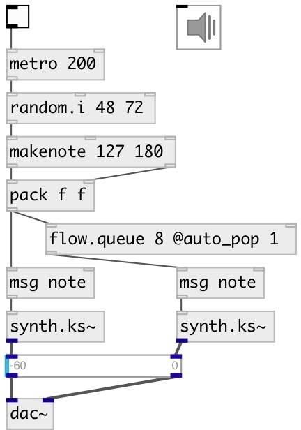

[index](index.html) :: [flow](category_flow.html)
---

# flow.queue

###### multi-channel control flow sync queue (or FIFO)

*available since version:* 0.9.1

---

## arguments:

* **MAX**
max queue size 
_type:_ int 

* **N**
number of lines 
_type:_ int 

## properties:

* **@max_size** 
Get/set max queue size 
_type:_ int 
_range:_ 1..1024 
_default:_ 32 

* **@auto_pop** 
Get/set auto pop mode. If true automatically pops oldest elements when queue is full 
_type:_ int 
_enum:_ 0, 1 
_default:_ 0 

## inlets:

* 1st queue input messages 
_type:_ control
* ... queue input messages 
_type:_ control
* n-th queue input messages 
_type:_ control
* clear: remove all elements from all queues, output: output all element from all queues, flush: output and clear all element from all queues, bang or pop: output and remove first message in all queues 
_type:_ control

## outlets:

* 1st queue output 
_type:_ control
* ... queue output 
_type:_ control
* n-th queue output 
_type:_ control

## keywords:

[counter](keywords/counter.html)

**Authors:** Serge Poltavsky

**License:** GPL3 or later

