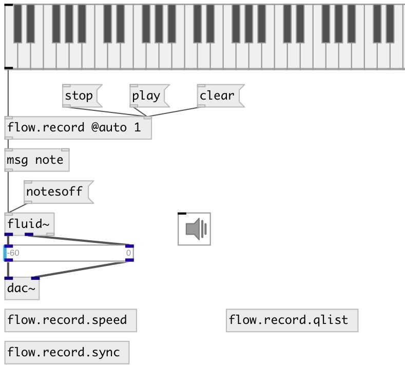

[index](index.html) :: [flow](category_flow.html)
---

# flow.record

###### flow stream recorder/player

*available since version:* 0.9

---

## properties:

* **@r** 
Get/set number of repeats in play mode. If -1: repeat infinitely 
__type:__ int 
__min value:__ -1 
__default:__ 1 

* **@max** 
Get/set max number of events, if 0: no max size check. If @auto is set - starts
playback when max size reached. 
__type:__ int 
__range:__ 0..65536 
__default:__ 256 

* **@speed** 
Get/set play speed 
__type:__ float 
__range:__ 0.015625..64 
__default:__ 1 

* **@auto** 
Get/set autostart record on first input atom 
__type:__ int 
__enum:__ 0, 1 
__default:__ 0 

* **@sync** 
Get/set use external bang pulse to sync recorded events with. 
__type:__ int 
__enum:__ 0, 1 
__default:__ 0 

## inlets:

* input message 
__type:__ control 
* sync tick (when @sync 1) 
__type:__ control 

## outlets:

* output message
__type:__ control 

## keywords:

[flow](keywords/flow.html)
[record](keywords/record.html)

**Authors:** Serge Poltavsky

**License:** GPL3 or later

