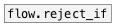

[<<< reference home](ceammc_lib.md)
---

# flow.reject

```


[F]
|
[flow.reject 0]
|
[swap 1]
|   ^|.
[/    ]
|
[F digits=12]


            
```
---
reject specified values
---
arguments:

values: list of atoms to reject<br>

---
properties:

@values: atoms to reject<br>

---
see also:<br>
[](flow.reject_if.md)
[](flow.pass.md)
