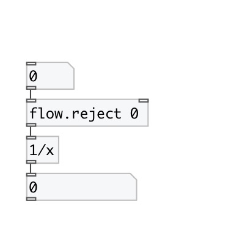

[< reference home](index.html)
---

# flow.reject

reject specified values

---

 

---

---
arguments:

values: list of atoms to reject 

---
properties:

@values: atoms to reject 

---
see also: 

