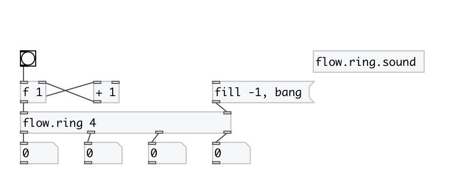

[index](index.html) :: [flow](category_flow.html)
---

# flow.ring
**aliases:** [flow.&gt;&gt;]

###### dataflow ring buffer

*available since version:* 0.9.1

---

## arguments:

* **LENGTH**
buffer length 
_type:_ int 

## properties:

* **@length** (initonly)
Get/set buffer length 
_type:_ int 
_range:_ 1..24 
_default:_ 2 

## inlets:

* input 
_type:_ control
* output all buffer values 
_type:_ control

## outlets:

* first output 
_type:_ control
* ... output 
_type:_ control
* n-th output 
_type:_ control

## keywords:

[ring](keywords/ring.html)
[buffer](keywords/buffer.html)
[dataflow](keywords/dataflow.html)

**Authors:** Serge Poltavsky

**License:** GPL3 or later

