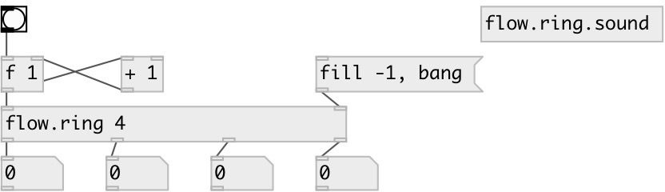

[index](index.html) :: [flow](category_flow.html)
---

# flow.ring

###### dataflow ring buffer

*available since version:* 0.9.1

---

## arguments:

* **N**
buffer length 
__type:__ int 

## properties:

* **@length** 
Get/set buffer length 
__type:__ int 
__range:__ 1..24 
__default:__ 2 

## inlets:

* input 
__type:__ control 
* output all buffer values 
__type:__ control 

## outlets:

* first output
__type:__ control 
* ... output
__type:__ control 
* n-th output
__type:__ control 

## keywords:

[ring](keywords/ring.html)
[buffer](keywords/buffer.html)
[dataflow](keywords/dataflow.html)

**Authors:** Serge Poltavsky

**License:** GPL3 or later

