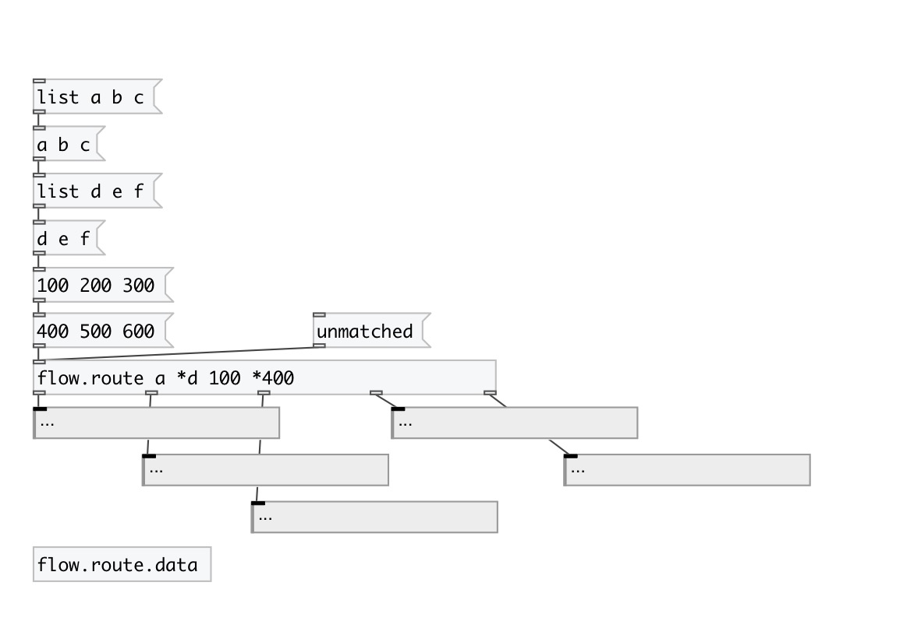

[< reference home](index.html)
---

# flow.route

advanced message router

---

if no match occured - output original message to last outlet
 

---

---
arguments:

MATCHES: list of route matches 

---
properties:

