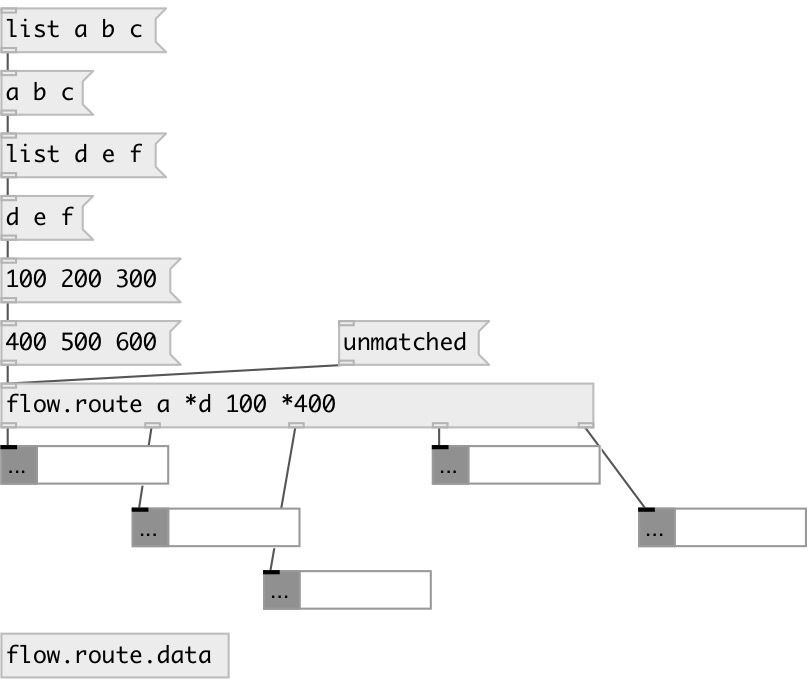

[index](index.html) :: [flow](category_flow.html)
---

# flow.route

###### advanced message router

*available since version:* 0.6

---

## information
if no match occured - output original message to last outlet if route starts with &#39;*&#39; - output with message selector

## arguments:

* **MATCHES**
list of route matches 
_type:_ list 

## inlets:

* match to first list element, output to corresponding outlet. If route starts with * output list &#39;as is&#39;, otherwise output without first element 
_type:_ control

## outlets:

* first pattern match output 
_type:_ control
* ... pattern match output 
_type:_ control
* n-th pattern match output 
_type:_ control
* unmatched output 
_type:_ control

## keywords:

[route](keywords/route.html)

**Authors:** Serge Poltavsky

**License:** GPL3 or later

