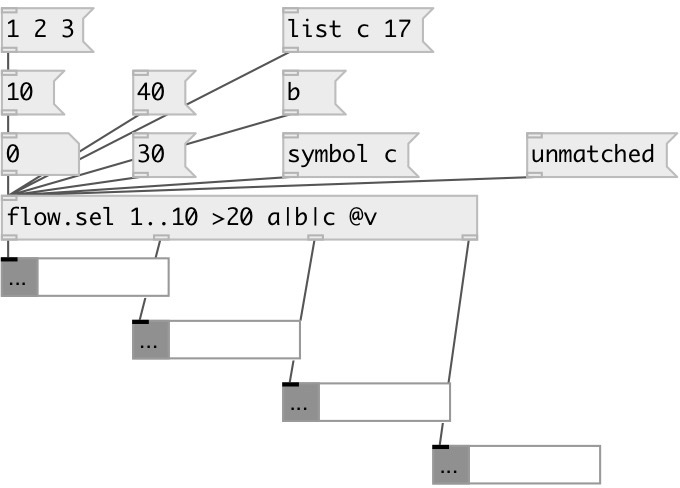

[index](index.html) :: [flow](category_flow.html)
---

# flow.select
**aliases:** [flow.sel]

###### vanilla flow on steroids

*available since version:* 0.9.1

---

## information
Match syntax: common: symbols or floats compare: &gt;NUM, &gt;=NUM, &lt;NUM, &lt;=NUM intervals: FROM..TO, or [FROM..TO] - closed interval, [FROM..TO) or (FROM..TO] semi-open interval, (FROM..TO) open interval, NUM~EPSILON - value in NUM+-EPSILON range set: A|B|C - match to A or B or C

## arguments:

* **ARGS**
flow match expressions 
_type:_ list 

## properties:

* **@v** 
Get/set alias to @keep_value 1 
_type:_ alias 

* **@keep_value** 
Get/set value output mode. If false (by default) acts like vanilla select: output bang
on match or full unmatched message to last outlet. If true always outputs full
matched message to corresponding outlet. 
_type:_ bool 
_default:_ 0 

## inlets:

* check float for matches 
_type:_ control

## outlets:

* first matched output: bang or full message 
_type:_ control
* ... matched output: bang or full message 
_type:_ control
* nth matched output: bang or full message 
_type:_ control
* unmatched message 
_type:_ control

## keywords:

[select](keywords/select.html)

**See also:**
[\[flow.match\]](flow.match.html)

**Authors:** Serge Poltavsky

**License:** GPL3 or later

