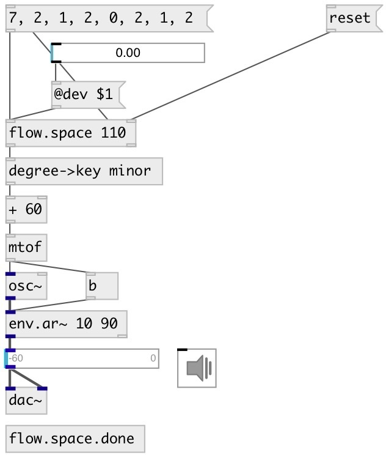

[index](index.html) :: [flow](category_flow.html)
---

# flow.space

###### space in time messages received at the same logical time

*available since version:* 0.9.1

---

## information
first message is delayed to next scheduler time

## arguments:

* **MS**
time space between messages 
_type:_ float 
_units:_ ms 

* **N**
time space = N*space after last outputted message 
_type:_ int 

## properties:

* **@delay** 
Get/set time-space between messages 
_type:_ float 
_units:_ ms 
_min value:_ 1 
_default:_ 1 

* **@done** 
Get/set time space (=@done*@delay) after last outputted message. After that delay
output bang to second outlet 
_type:_ int 
_min value:_ 0 
_default:_ 1 

## inlets:

* messages 
_type:_ control
* set space interval (ms) 
_type:_ control

## outlets:

* output 
_type:_ control
* bang on finish (after @delay*@done ms after last outputted message) 
_type:_ control

## keywords:

[space](keywords/space.html)

**Authors:** Serge Poltavsky

**License:** GPL3 or later

