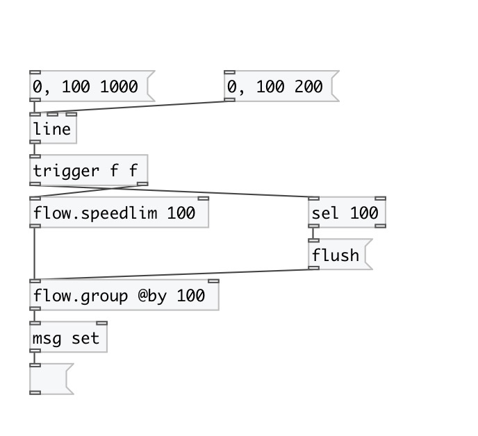

[< reference home](index.html)
---

# flow.speedlim

control stream speed limiter

---

Passthru all control data not often then specified limit in ms. Can be used for
            button debouncing. In initial state is opened, on first message pass it and then became
            closed within specified time interval. All incoming messages in that time are dropped.
            After this interval expiried goes to opened state
 

---

---
arguments:

TIME(ms): limit time 

---
properties:

@limit(ms): speed
            limit. If set to zero there is no flow limitations 

