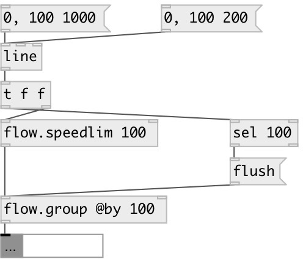

[index](index.html) :: [flow](category_flow.html)
---

# flow.speedlim
**aliases:** [ceammc/speedlim], [speedlim]

###### control stream speed limiter

*available since version:* 0.5

---

## information
Passthru all control data not often then specified limit in ms. Can be used for button debouncing. In initial state is opened, on first message pass it and then became closed within specified time interval. All incoming messages in that time are dropped. After this interval expiried goes to opened state

## arguments:

* **TIME**
limit time 
_type:_ int 
_units:_ ms 

## properties:

* **@limit** 
Get/set speed limit. If set to zero there is no flow limitations 
_type:_ int 
_units:_ ms 
_min value:_ 0 
_default:_ 0 

## inlets:

* input flow 
_type:_ control
* reset internal timer and goes to opened state 
_type:_ control

## outlets:

* output flow 
_type:_ control

## keywords:

[speelim](keywords/speelim.html)
[drop](keywords/drop.html)

**Authors:** Serge Poltavsky

**License:** GPL3 or later

